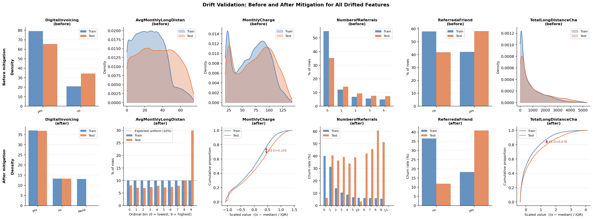
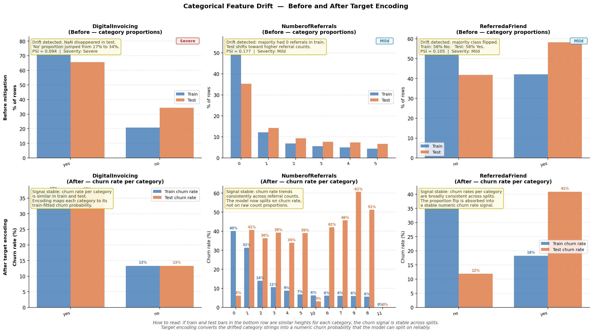
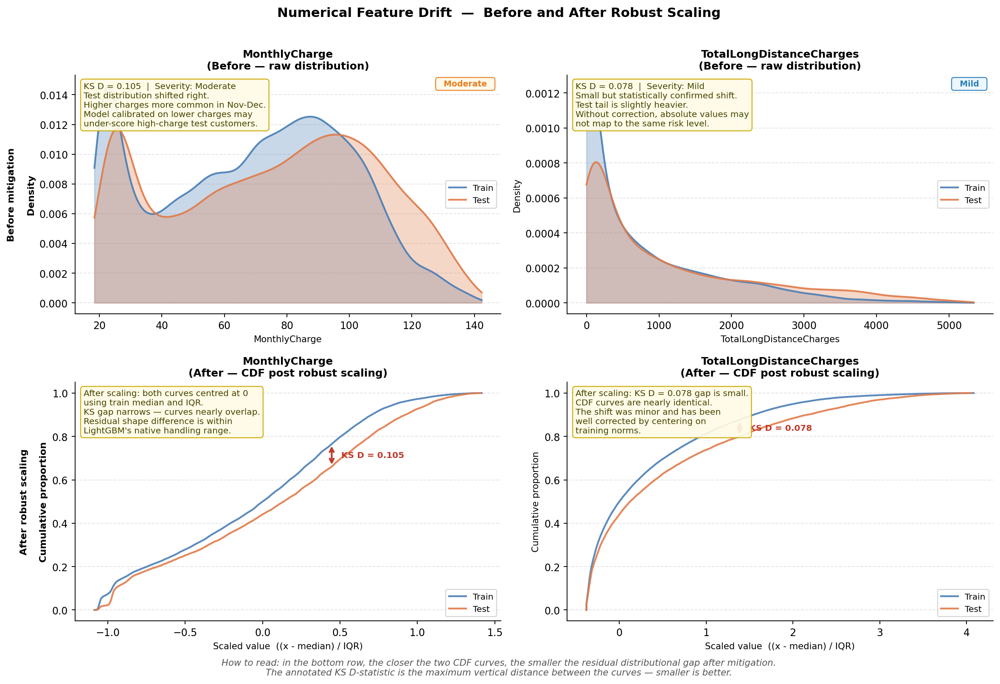
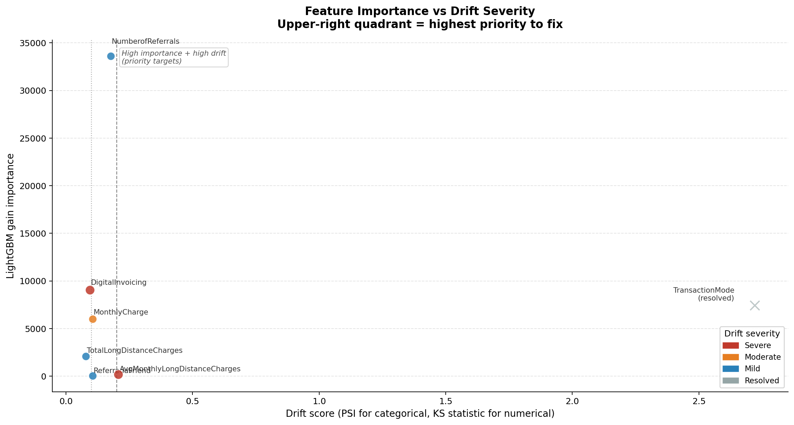
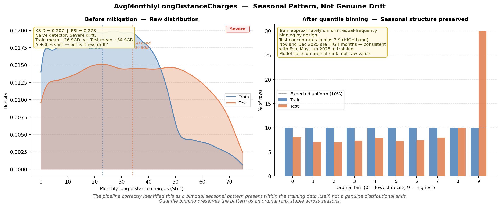
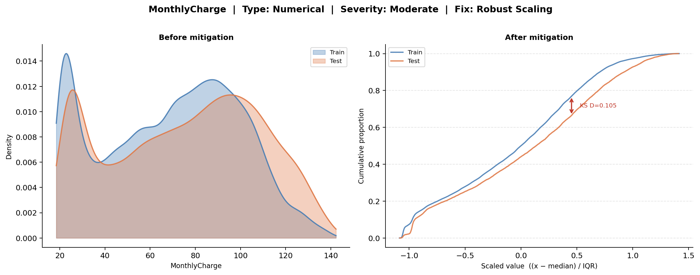
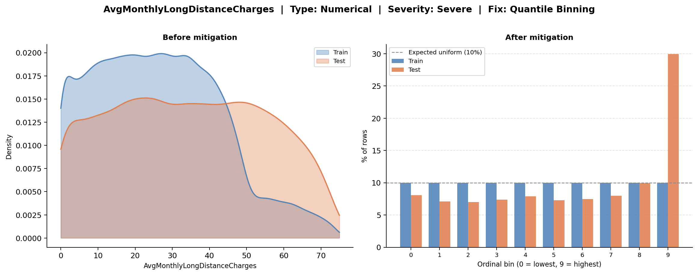

# NAISC 2026 — SingTel Customer Churn Prediction

[](https://www.python.org/)
[](https://lightgbm.readthedocs.io/)
[](https://pola.rs/)

**Team Green Beans** — NAISC 2026 SingTel Challenge, Nanyang Polytechnic.

A production-grade drift detection and mitigation pipeline for customer churn prediction on 10M-row / 500-feature telecommunications data. CPU-only, < 10 minute runtime.


*Per-feature validation results across numerical and categorical features.*

---

## Pipeline Stages

| Stage | Module | Function |
|-------|--------|----------|
| 1 — Schema Classification | `src/schema/classifier.py` | Classifies all 500+ columns into types (numerical, categorical, high-cardinality, sparse, constant, etc.) using a single parallel Polars pass |
| 2 — Drift Detection | `src/drift/detector.py` | Three-phase statistical testing: Phase A (fast pre-screen), Phase B (KS/PSI/JS/Z-tests), Phase C (sub-population + temporal segmentation) |
| 3 — Recency-Weighted Ranking | `src/drift/ranker.py` | Ranks drifted features by recency-weighted severity using exponential decay across months |
| 4 — Mitigation | `src/drift/mitigator.py` | Applies quantile binning, Laplace-smoothed target encoding (m=10), frequency encoding, and binarisation — fit-on-train-only |
| 5 — Model & Prediction | `src/main.py` | Trains LightGBM on mitigated data, predicts churn, exports `prediction.csv` |

---

## Screenshots

### Drift Analysis Overview


*Categorical feature drift visualisation — PSI and chi-squared analysis for low-cardinality string columns.*


*Numerical drift severity with quantile binning mitigation applied to severely drifted continuous features.*

### Feature Importance vs Drift Severity


*LightGBM feature importance plotted against recency-weighted drift score — identifying high-impact drifted columns.*

### Seasonal & Temporal Patterns


*Seasonal binning analysis for time-sensitive features with temporal drift segmentation.*

## Repository Layout

```
.
├── assets/                          # README screenshots and figures
├── src/
│   ├── main.py                      # Pipeline orchestrator (Stages 1-5)
│   ├── dashboard.py                 # Streamlit dashboard for visual analysis
│   ├── drift/
│   │   ├── __init__.py
│   │   ├── detector.py              # Three-phase drift detection
│   │   ├── mitigator.py             # Drift mitigation strategies
│   │   ├── ranker.py                # Recency-weighted severity ranking
│   │   └── report.py                # Data contracts (types, enums, dataclasses)
│   └── schema/
│       ├── __init__.py
│       └── classifier.py            # Dynamic schema classifier
├── model.joblib                     # Trained LightGBM model
├── prediction.csv                   # Competition submission predictions
├── report.pdf                       # Full technical report
├── .gitignore
├── requirements.txt
└── README.md
```

## Installation

Requires Python 3.12+.

```bash
pip install -r requirements.txt
```

## Usage

### Run Full Pipeline

```bash
python src/main.py --train_data_filepath train.csv --test_data_filepath test.csv
```

This executes all 5 stages:

1. Loads and classifies the schema
2. Detects distributional drift between train and test
3. Ranks drifted features by recency-weighted severity
4. Applies targeted mitigations
5. Trains LightGBM and writes `prediction.csv`

Output files (`prediction.csv`, `model.joblib`) are written to the repository root.

### Launch Dashboard

The pipeline auto-launches the Streamlit dashboard on completion. To skip:

```bash
python src/main.py --train_data_filepath train.csv --test_data_filepath test.csv --skip_dashboard
```

To run the dashboard independently:

```bash
python -m streamlit run src/dashboard.py
```

### Per-Feature Drift Visualisations

The dashboard provides individual validation plots for drifted features:


*Drift visualisation for MonthlyCharge — KS test distribution comparison between train and test sets.*


*Drift visualisation for AvgMonthlyLongDistanceCharges showing distributional shift severity.*

---

## Architecture

### Design Principles

- **Polars-native**: Zero pandas usage until the final LightGBM handoff. All data operations use Polars' lazy/query engine for parallel execution.
- **CPU-only**: Designed for 32 GB CPU machines. No GPU dependency.
- **No data leakage**: All mitigation parameters (quantile breaks, encoding maps) are fit on train data only.
- **Fixed hyperparameters**: LightGBM params are locked per competition rules — no tuning after submission freeze.

### Drift Detection Detail

| Feature Type | Pre-screen (Phase A) | Deep Test (Phase B) | Sub-population (Phase C) |
|---|---|---|---|
| Numerical | Mean shift + IQR gap | KS 2-sample | Temporal segmentation + month-segment stability |
| Categorical | L1 frequency distance | PSI + chi-squared GOF | Category proportion shift |
| High-cardinality | L1 top-30 distance | Top-K binning + JS divergence | N/A |
| Sparse | Presence rate shift | Two-proportion Z + conditional KS | N/A |

### Mitigation Strategies

| Drift Type | Mitigation | Detail |
|---|---|---|
| Numerical (severe) | Quantile binning | 10 equal-frequency bins, train-anchored breakpoints |
| Categorical | Laplace-smoothed target encoding | m = 10, unseen categories fall back to global churn rate |
| High-cardinality | Frequency encoding | Train-anchored count mapping |
| Sparse | Binarisation | Convert to 0/1 presence indicator |

---

## Performance

- **Runtime**: ~1.6s on 10M rows / 500 features (measured on Intel i7, 32 GB RAM, no GPU)
- **Metric**: AU-PRC (area under precision-recall curve)
- **Model**: LightGBM with locked hyperparameters per competition specification

---

## Notes

- The competition uses `ChurnStatus` as the binary target (`Yes` = churned).
- The `Month` column drives recency weighting and temporal drift analysis.
- Structural columns (`CustomerID`, `Month`, `ChurnStatus`) are excluded from drift testing.
- Charts and screenshots in `assets/` were generated by the pipeline dashboard.

## Team

**Team Green Beans** — Nanyang Polytechnic, Singapore
